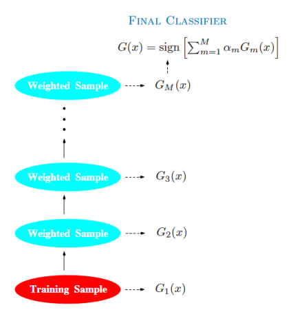
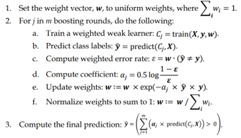

# AdaBoost from Scratch
This repository contains a custom AdaBoost implementation, created from scratch in Python. It also includes an experiment applying this AdaBoost model on the Wisconsin Breast Cancer dataset. This implementation does not rely on pre-existing machine learning libraries for the AdaBoost algorithm, making it a great resource for those wishing to understand the underlying workings of the AdaBoost model.

## What is AdaBoost?
AdaBoost (Adaptive Boosting) is a powerful ensemble machine learning algorithm. It works by combining multiple "weak classifiers" into a single "strong classifier". A weak classifier (or weak learner) is a machine learning model that achieves accuracy just above random chance on a binary classification problem. The most suited and therefore most common algorithm used within AdaBoost is the Decision Tree algorithm. The weak learners in AdaBoost are usually decision trees with a single split, called decision stumps.


[Source: CMU Boosting Lecturer Notes](https://www.stat.cmu.edu/~ryantibs/datamining/lectures/25-boost.pdf)

AdaBoost is adaptive in the sense that subsequent weak learners are tweaked in favor of those instances misclassified by previous classifiers. AdaBoost is sensitive to noisy data and outliers but is less likely to overfit than other learning algorithms.

## Pseudocode

[Source: Python Machine Learning Third Edition](https://falksangdata.no/wp-content/uploads/2022/07/python-machine-learning-and-deep-learning-with-python-scikit-learn-and-tensorflow-2.pdf)

## Repository Structure
- `ml_from_scratch/*`: This folder contains the implementation of AdaBoost from scratch. You can check `_weight_boosting.py` to see the full code or make some changes.
- `experiment.py`: This file contains the application of the AdaBoost model on the Breast Cancer dataset, using our custom AdaBoost implementation and compare the performance with AdaBoost from Scikit-learn.

## How to Use
To use this code, you will first need to have Python and Poetry installed on your machine. [Poetry](https://python-poetry.org/docs/) is a dependency management tool for Python that allows you to declare the libraries your project depends on and it will manage (install/update) them for you. 

Follow these steps to run the code:

1. Clone the repository to your local machine.
```bash
git clone https://github.com/yourusername/adaboost-from-scratch.git
cd adaboost-from-scratch
```

2. Install the required packages.
```bash
poetry install
```

3. Activate the poetry virtual environment.
```bash
poetry shell
```

4. Run the experiment file.
```bash
python experiment.py
```

## Experiment result
When running experiment.py, the custom AdaBoost model will be applied to the Breast Cancer dataset, and the performance is then compared to Scikit-learn's AdaBoost implementation. Based on the experiment's result below, our AdaBoost has a competitive performance compared to AdaBoost from Scikit-learn. AdaBoost from Scikit-learn perform better in term of accuracy and training time is due to their Cython and SAMME algorithm implementation.

```bash
Adaboost Classifier
-------------
n_estimators: 5; val score: 91.23%
training time: 0.04s
n_estimators: 10; val score: 91.23%
training time: 0.07s
n_estimators: 15; val score: 93.42%
training time: 0.08s
n_estimators: 20; val score: 89.91%
training time: 0.08s
n_estimators: 25; val score: 91.23%
training time: 0.09s
Best n_estimators: 15
Best n_estimators acc. validation  : 93.42%
acc. train  : 89.87%
acc. test  : 91.23%

Adaboost Classifier (SKLEARN)
-------------
n_estimators: 5; val score: 94.30%
training time: 0.02s
n_estimators: 10; val score: 93.42%
training time: 0.04s
n_estimators: 15; val score: 93.86%
training time: 0.04s
n_estimators: 20; val score: 93.86%
training time: 0.07s
n_estimators: 25; val score: 94.74%
training time: 0.09s
Best n_estimators: 25
Best n_estimators acc. validation  : 94.74%
acc. train  : 100.00%
acc. test  : 93.86%
```

## Acknowledgements
This work was inspired by [AdaBoost by Freund and Schapire (1990)](https://link.springer.com/article/10.1007/bf00116037), a powerful ensemble method.